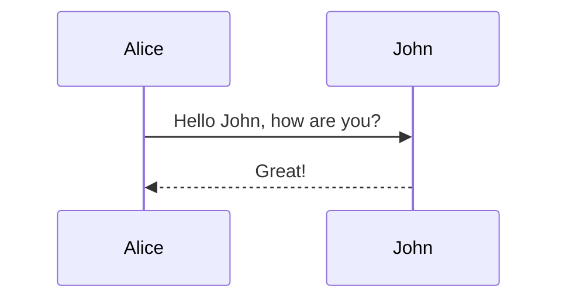

# Architektur des Online-Shops

Beschreiben Sie in dieser Datei die Architektur (Teilaufgabe 1) Ihres Webshops.
Verwenden Sie zur Formatierung [GitLab Flavored Markdown (GFM)](https://docs.gitlab.com/ee/user/markdown.html), so dass
sich die Datei auf GitLab schön lesen lässt.

Sie können Grafiken z.B. per [Mermaid](https://mermaidjs.github.io/) einbinden:

Zum Vorbereiten bietet sich der [Mermaid Live Editor](https://mermaid-js.github.io/mermaid-live-editor/) an.

Sie können aber auch Grafiken mit einem extra Programm erzeugen und
als [Images einbinden](https://docs.gitlab.com/ee/user/markdown.html#images).

Wenn Sie Ihre Dokumentation in mehrere Dateien aufteilen, verlinken Sie sie aus dieser
Datei heraus so, dass ich auf der GitLab Site navigieren kann.
