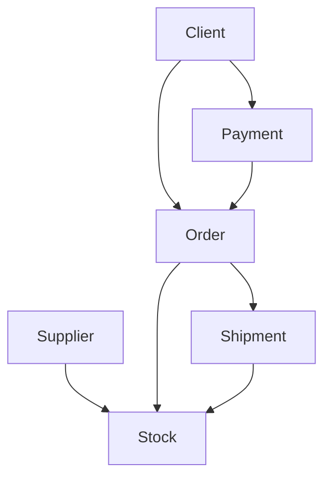
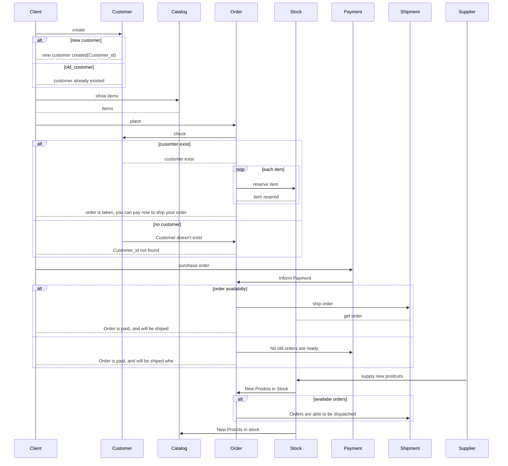

# Architektur des Online-Shops

```mermaid
graph TD;
  Client-->Order;
  Client-->Payment;
  Supplier-->Stock;
  Payment-->Order;
  Order-->Shipment;
  Order-->Stock;
  Shipment-->Stock;
```

```mermaid
sequenceDiagram
  Client->>Customer: create
    alt new customer
        Customer-->Client: new customer created(Customer_id)
    else old_customer
        Customer-->Client: customer already existed
    end
 Client->>Catalog:show items
 Catalog-->Client:Items   
 Client->>Order: place
 Order->>Customer: check
    alt cusomter exist
        Customer-->Order: customer exist
         loop each item
         Order->>Stock: reserve item
         Stock --> Order: item resered
        end
        Order --> Client: order is taken, you can pay now to ship your order
    else no customer
        Customer->>Order: Customer doesn't exist
        Order-->Client: Customer_id not found
    end
Client->>Payment:purshase order
Payment->>Order:Inform Payment
    alt order availabilty
        Order ->> Shipment: ship order 
        Shipment --> Stock: get order
        Order --> Client: Order is paid, and will be shiped
    else
        Order ->> Payment:No old orders are ready
        Order --> Client :Order is paid, and will be shiped whe
    end

Supplier->>Stock:supply new prodcuts
Stock->>Order:New Prodcts in Stock
    alt availabe orders
        Order->>Shipment: Orders are able to be dispatched
    END
Stock->>Catalog:New Prodcts in stock

    


```

